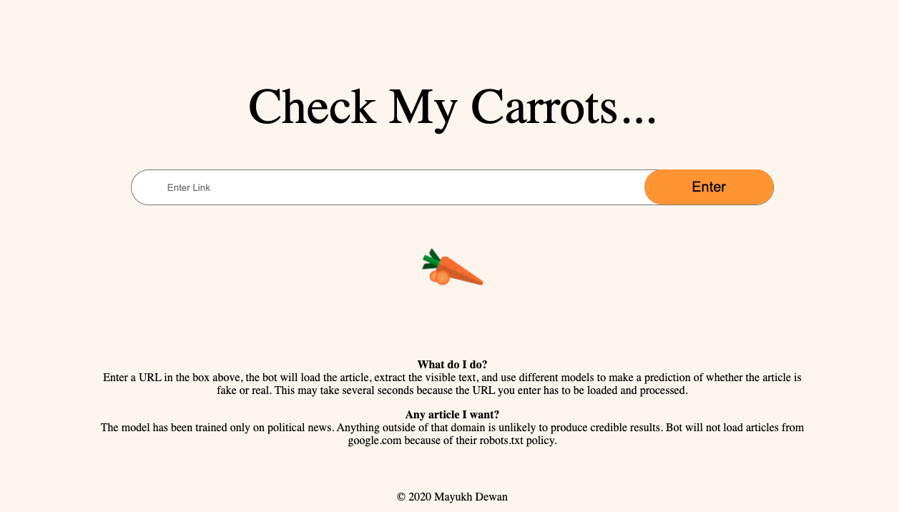
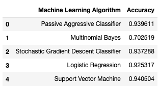

# CheckMyCarrots

# Introduction
Do you trust all the news you hear from social media? All news are not real, right? So how will you detect the fake news? We will be using passive aggressive classifier to classify the news article scrapped from the news article link, as fake or real.

# Data
The dataset we’ll use for this python project- we’ll call it news.csv. The first column identifies the news, the second and third are the title and text, and the fourth column has labels denoting whether the news is REAL or FAKE. The dataset can be downloaded from [here](https://www.dropbox.com/s/a9tnlsont46g9wg/news_dataset.csv?dl=0)

# Project Structre
This project has four major parts :

* fake_news.py - This contains code fot our Machine Learning model to classify the model 
* app.py - This contains Flask APIs that receives news url through GUI or API calls, extracts the article from the url, feeds it to the model and returns the prediction.
* templates - This folder contains the HTML template to allow user to enter url and displays whether the news is fake or real.
* static - This folder contains the CSS file.
* requirements.txt - It contains the list of libraries required to run the heroku app

# Algo Selection

Used various machine learning algorithms to figure out the most optimial one for our problem the accuracy scores for each algorithm are below and check the jupyter notebook for implementations.

